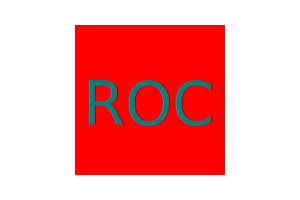

# Node SVG Logo Generator

  ## Description

  The purpose of this application is to allow the user to have the ability to be able to be able to generate an SVG Logo, using a Command Line Interface. Along with a logo generator, the user can also test the applications code by running "npm test" in the CLI.

  

  ## Table of Contents

  -[Installation](#installation)

  -[Usage](#usage)

  -[Credits](#credits)

  -[License](#license)

  -[Contribution](#contribution)

  -[Tests](#tests)

  -[Questions](#questions)

  ## Installation

  To install this application simply copy the code down into your own files, and be sure to have Node.js installed. Then be prepared to initialize the folder containing the application using the CLI by using "npm init -y", then by running "npm install," and installing both "-inquirer" and "-jest."

  ## Usage

  To use the application, run "node index.js". To run the tests associated, run "npm test". Both of which are input into the CLI.

  [Video for Application in use here](<examples/Untitled_ Jul 28, 2023 7_33 PM.webm>)

  ## Credit

  N/A

  ## License

  

  
  

  

  ## Contribution

  N/A

  ## Tests

  The tests for this application are as follows: Color Matching, Text Length, Shape Color, and tests to be certain for the Shapes Circle, Square, and Triangle.

  ## Questions

  If you have any questions feel free to reach out @: N/A

